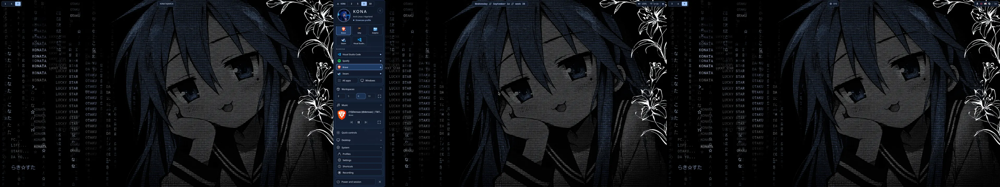
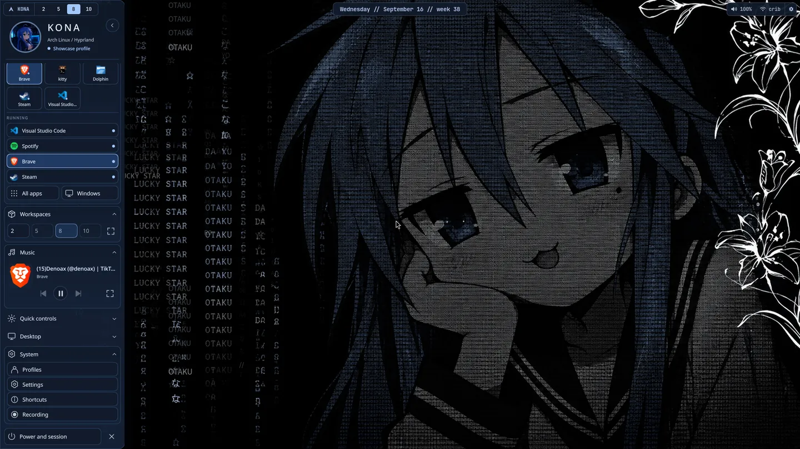
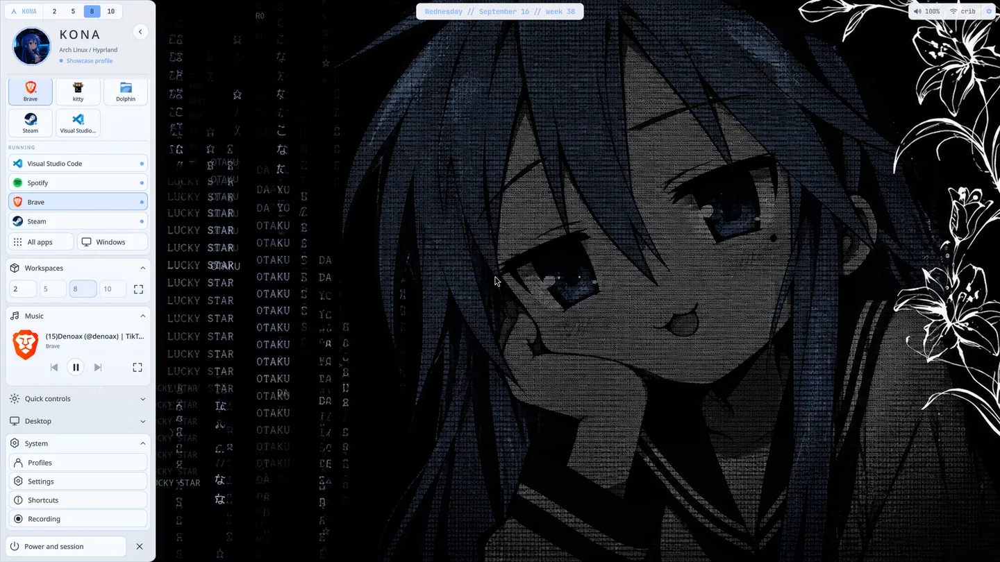
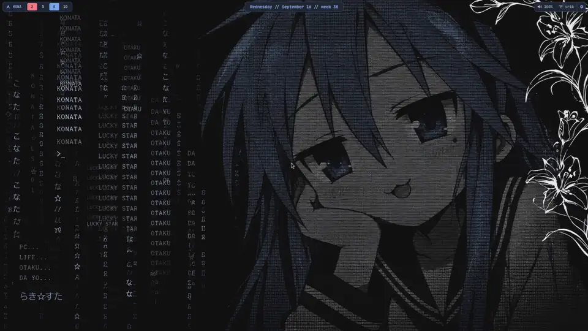
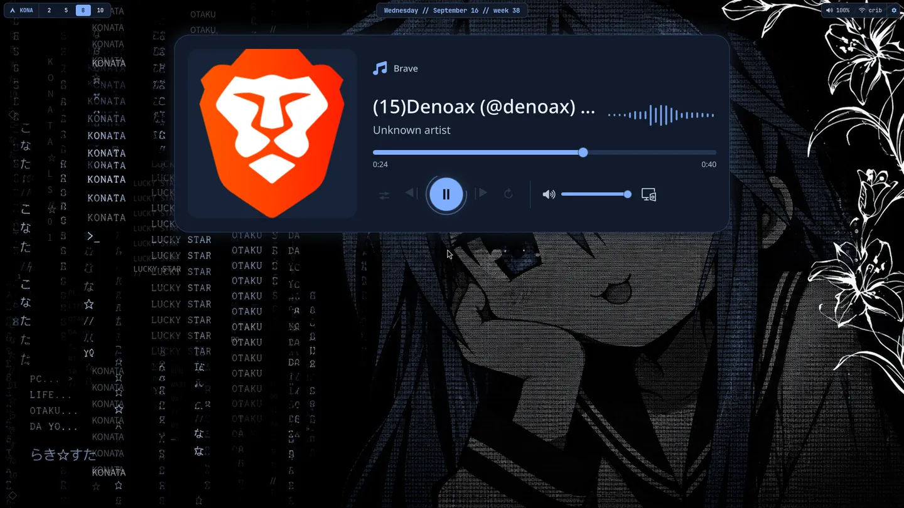
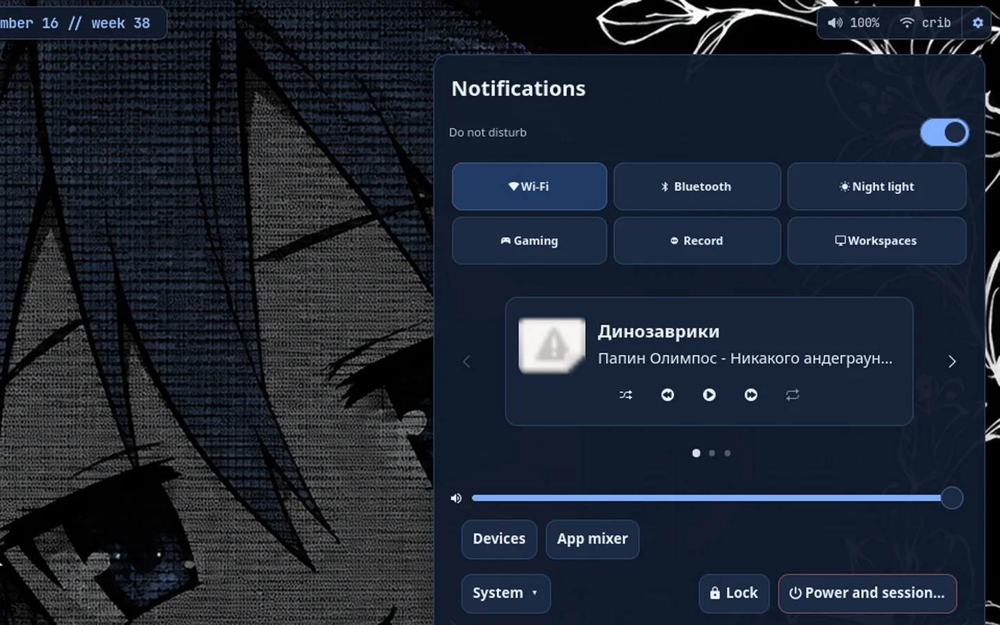
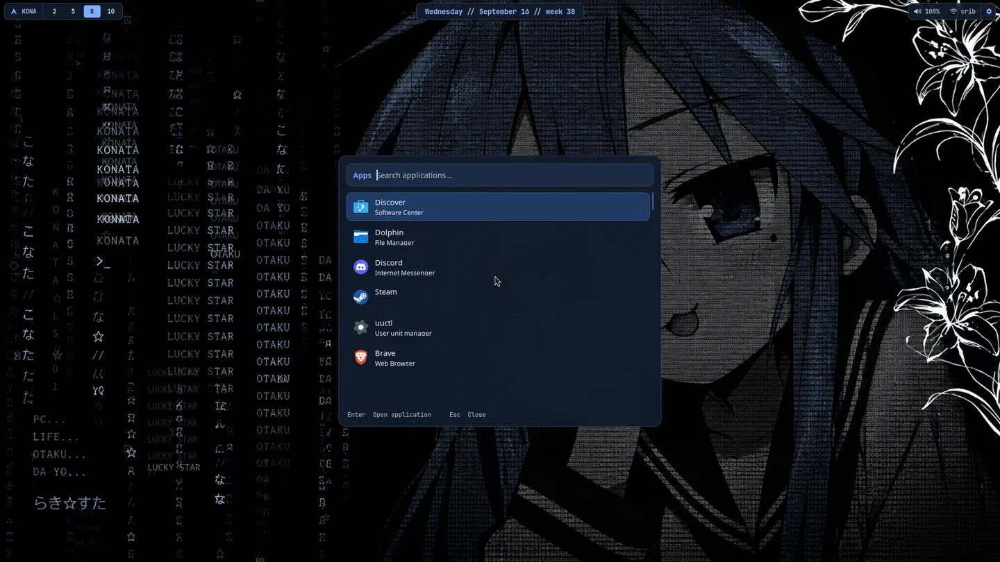
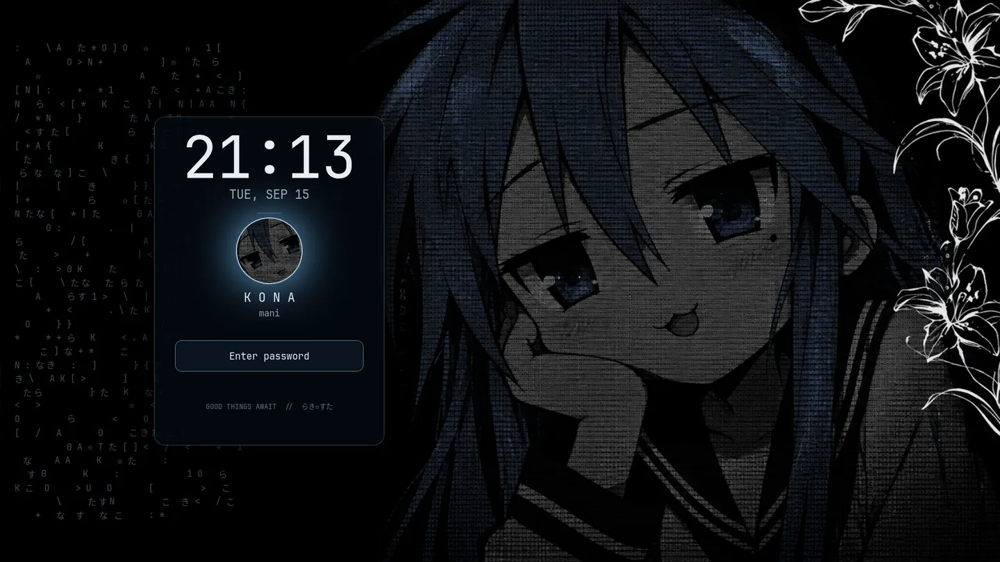

# Kona Desktop



A Konata Izumi themed Arch Linux and Hyprland desktop built for daily use on one real workstation.

Kona combines Hyprland's native Lua configuration with a full-height Quickshell sidebar, event-driven workspace state, unified transient menus, an MPRIS music popup, system Light/Dark propagation, profiles, recovery tools, and the monochrome Mono Rain scene. It is a personal three-monitor profile made public to use, study, and adapt.

## The desktop

| Dark | Light |
| --- | --- |
|  |  |



| Native music popup | Notifications and control center |
| --- | --- |
|  |  |

| Launcher | Lock screen |
| --- | --- |
|  |  |

The wallpaper's character and flowers stay stable while the left text field moves in a deterministic loop. The lock screen uses its own matching 80-frame rain cycle; Hyprlock and PAM remain the only authentication path.

## What is custom

- **Primary navigation:** an auto-hiding Quickshell sidebar replaces the retired dock. It owns profile identity, app navigation, workspaces, media and desktop controls.
- **One appearance owner:** `kona-appearance` coordinates Kona's semantic tokens, portal preference, GTK, Qt and websites that follow `prefers-color-scheme`.
- **One owner per runtime:** Hyprland starts the plain-session shell; packaged systemd units own polkit and notifications; menus and policy commands remain transient.
- **Four profiles:** Daily, Focus, Showcase and Gaming select scenes and policy without creating another theme daemon.
- **Unified menus:** Rofi, SwayNC and SwayOSD share the same semantic color, motion, focus and feedback language.
- **Recoverable state:** window sessions, workspace previews, config backups and scoped rollback live under `~/.local/state/kona/`.

See [Architecture](docs/ARCHITECTURE.md) for the owner map and generated-state boundaries.

## Install

This is an opinionated Arch profile, not a universal Hyprland distribution. Read the plan before writing anything:

```bash
git clone https://github.com/Denoax/konata-hyprland-dotfiles.git
cd konata-hyprland-dotfiles
./install.sh --dry-run
```

Before the first real install, review [the installation guide](docs/INSTALL.md) and [Mani's hardware profile](docs/HARDWARE_PROFILE.md). In particular, change the checked-in connector names, modes and workspace map in `.config/hypr/hyprland.lua` for your displays.

```bash
./install.sh
```

The installer backs up every target it replaces. It does not install system packages or machine-specific GPU drivers. Optional personal Flatpaks require `--with-flatpaks`. The canonical login is **PlasmaLogin → Hyprland**, using the plain `/usr/bin/start-hyprland` session.

## Everyday controls

| Control | Action |
| --- | --- |
| Tap `Super` | Pin or hide the sidebar |
| Hover the left edge | Reveal the sidebar temporarily |
| `Super + Space` | Applications |
| `Super + Shift + Return` | Notifications / control center |
| `Alt + Tab` | Window switcher |
| `Super + V` | Clipboard |
| `Super + W` | Workspace overview |
| `Super + Ctrl + P` | Profile picker |
| `Super + Shift + W` | Wallpaper picker |
| `Super + L` | Lock |
| `Ctrl + Alt + Delete` | Power and session menu |

The complete map is in [Keybinds](docs/KEYBINDS.md).

## Customize without fighting generated state

- Edit monitor and input rules in `.config/hypr/hyprland.lua`.
- Edit semantic source colors in `.config/kona/appearance/light.json` and `dark.json`; use `kona-appearance light|dark` to render and apply them.
- Manage scenes in `.config/kona/profiles.json` and `.config/kona/scene-images.json`.
- Treat `.config/kona/theme/current/` as generated output.
- Keep private application theme overrides in the application itself; Kona does not rewrite browser or editor profiles.

See [Customization](docs/CUSTOMIZATION.md) before changing generated files.

## Recovery and current status

Use `./install.sh --config-only` to restore the checked-in configuration without downloading user-local helpers. Existing files are copied to `~/.local/state/kona/pre-restore-*` first. [Recovery](docs/RECOVERY.md) covers the Plasma fallback, appearance rollback and runtime checks.

The current visual checkpoint is accepted and represented by the real screenshots above. Runtime ownership has passed in-session restart, crash recovery and authorization checks. One complete real PlasmaLogin logout/login lifecycle check remains; see [Current status](docs/CURRENT_STATUS.md).

The previous dock/media-deck desktop remains available as the [Legacy desktop](https://github.com/Denoax/konata-hyprland-dotfiles/tree/legacy/pre-kona-2026.09).

## Credits and license status

Konata Izumi and *Lucky Star* belong to their respective creators and rights holders. This is an unofficial, non-commercial fan project and is not affiliated with or endorsed by those rights holders, Arch Linux, Hyprland, or the other upstream projects it integrates.

The repository does not currently grant a project-wide license. Third-party components and artwork retain their own terms; see [Third-party notices](THIRD_PARTY_NOTICES.md).
