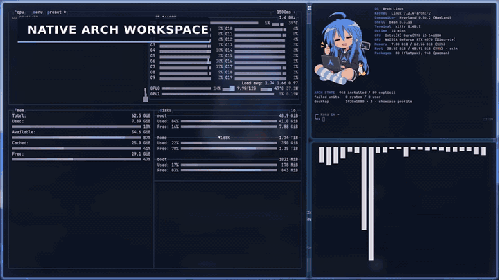
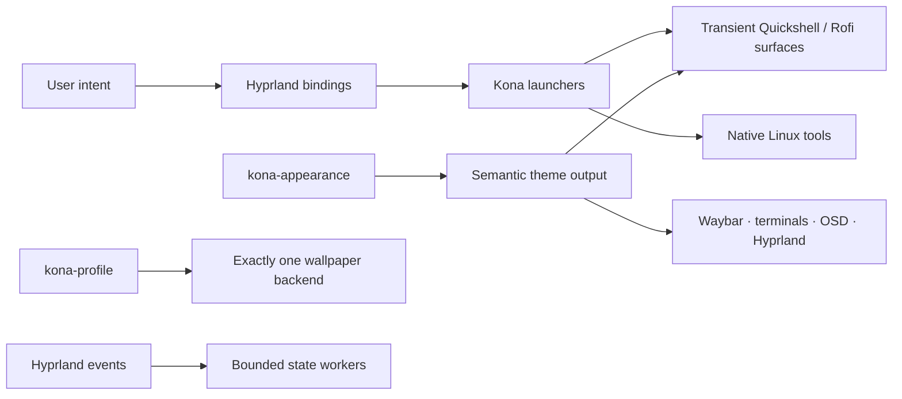

<div align="center">


# Kona Desktop V3

**Konata energy. Arch discipline.**<br>
A polished Hyprland workstation built from real Linux tools, explicit state owners and one coherent pastel-blue visual language.

[](https://archlinux.org/)
[](https://hypr.land/)
[](https://quickshell.org/)
[](docs/CURRENT_STATUS.md)
[](LICENSE)

[Features](#the-desktop-at-a-glance) · [Architecture](#engineered-as-a-system) · [Shortcuts](#daily-driver-shortcuts) · [Install](#install-on-arch) · [Status](docs/CURRENT_STATUS.md)



*A quiet desktop until you ask for more.*

</div>

> [!IMPORTANT]
> Kona is an opinionated configuration for a real Arch workstation. It is not an ISO or a universal installer. Read the [hardware boundary](docs/HARDWARE_PROFILE.md), inspect the package manifest and run the installer dry-run first.

## The desktop at a glance

| Shell | Workflows | System | Presentation |
| --- | --- | --- | --- |
| Auto-hiding left hotbar | Live app search + workspace overview | Transactional Light / Kona / Dark | Konata-inspired semantic palette |
| Connected Waybar entrypoints | Arch workspace with Btop, Fastfetch + CAVA | PipeWire, NetworkManager + BlueZ | Shared motion + Reduced Motion |
| Media, performance + Weather dashboard | Modern Foot/Fish/Starship terminal | Hyprlock/PAM authentication | Current-wallpaper lock continuity |
| Notification center + OSD | Scratch terminal + command center | Profiles, scenes + recovery | Wallpaper Engine Workshop support |

### The complete surface set

- **Navigation:** profile header, workspaces, applications, music, Weather, quick controls, desktop actions, system tools and power/session.
- **Dashboard:** real media, performance, Weather and audio state using the credited Caelestia presentation layer.
- **Overview:** live Hyprland workspaces and windows, application search, Alt+Tab navigation and detached app launching using pinned end-4 components.
- **Intelligence:** optional Intelligence, Translate and Anime tabs; secrets stay in Secret Service and model-issued system tools default off.
- **Notifications:** one persistent end-4 notification owner, real history, actions, DND, popups and a right-edge center.
- **System menus:** audio devices, per-app volume, network, Bluetooth, clipboard, wallpaper, profiles, settings, confirmations and session actions.
- **Capture:** full/region screenshots, annotation, region/output recording and SwayOSD feedback.
- **Terminals:** normal and scratch Foot sessions with Fish, Starship, completions and history-based autosuggestions; Kitty stays scoped to the image-capable Arch workspace.

## A shell that gets out of the way


The left edge is Kona's primary navigation surface. It auto-hides, reveals from a hot edge, pins on demand, remembers its state and follows the shared Reduced Motion policy. Kona keeps its broad information architecture while adopting the tighter grouping and spatial motion of [Caelestia](https://github.com/caelestia-dots/shell).

The top bar stays concise: workspaces, time and real system state. Search and Alt+Tab rise from the workspace overview; notifications live on the right. Each edge has one job, so the normal desktop remains calm.

## Real tools, composed natively

### Arch workspace


`Super + Shift + D` toggles `special:arch` with three real terminal windows:

- **Btop** for live CPU, GPU, memory and storage state;
- **Fastfetch** for a compact machine summary and an interactive shell;
- **CAVA** for the active PipeWire output.

Hyprland owns the composition. The launcher identifies every window by a deterministic class, prevents duplicates and terminates only its own children on close. Ten-cycle lifecycle validation is part of the regression suite; a closed Arch workspace leaves zero Arch-workspace processes.

| Fastfetch + interactive shell | Desktop command center |
|:---:|:---:|
|  |  |

There is no QML terminal imitation and no fake telemetry. `Super + Grave` owns one scratch terminal; `Alt + Return` and `Super + Return` open the normal terminal workflow.

### Music

| Light | Dark |
|:---:|:---:|
|  |  |

The Quickshell popup reads real MPRIS metadata, controls playback and volume through the existing PipeWire/WirePlumber stack, and starts one scoped CAVA visualizer only while visible. The Caelestia media dashboard provides the larger library and device view.

### Weather

Weather now lives in the shared dashboard instead of a second floating app. An explicit Kona location and unit file feeds cached Open-Meteo data to both the sidebar summary and dashboard. Refresh is bounded and on demand; no resident weather poller or IP-location fallback is introduced.

### Notifications, quick settings and assistance

Kona integrates the strongest parts of [end-4/dots-hyprland](https://github.com/end-4/dots-hyprland) at a pinned revision: its live overview, notification center, Intelligence/Translate/Anime surface and binding cheat sheet. Kona remains responsible for appearance, profiles, lock, wallpaper, session actions and lifecycle policy.

This is deliberate reuse rather than a visual fork hidden behind a new name. Upstream code remains under its original license and is credited in [Upstream UI credits](docs/kona/UPSTREAM_UI_CREDITS.md).

## Three appearances, one authority

| Dark | Light |
|:---:|:---:|
|  |  |

`kona-appearance` is the only durable appearance owner:

- **Light** — frosted icy-white surfaces and the standard system Light preference.
- **Kona** — a softer pastel-blue desktop while websites and ordinary applications remain on the system Dark preference.
- **Dark** — the deeper midnight-blue counterpart.

All three use the same semantic color contract and geometry. A switch renders and validates generated fragments, updates supported GTK/Qt and XDG portal preferences, reloads consumers, verifies convergence and commits atomically. Failure restores the previous state.

```bash
kona-appearance light
kona-appearance kona
kona-appearance dark
kona-appearance toggle
kona-appearance status
```

## Profiles, wallpapers and lock continuity


| Profile | Policy |
| --- | --- |
| **Daily** | Balanced effects and the selected daily wallpaper |
| **Focus** | Static, restrained and distraction-light |
| **Gaming** | Static wallpaper and the cleanest runtime policy |
| **Showcase** | Explicit opt-in motion and presentation effects |

The wallpaper transaction selects exactly one backend: Wallpaper Engine, Awww or Hyprpaper. Downloaded Workshop Scene and Video projects can become the Daily/Showcase default; Focus and Gaming keep their static policy. Hyprlock receives the active backdrop and shared profile avatar while PAM remains the only authentication owner.

> [!WARNING]
> Wallpaper Engine **Web** projects remain experimental on the tested Hyprland/NVIDIA stack because one validated Web project later triggered a compositor framebuffer crash. Scene and Video projects use bounded startup fallback; Web projects require explicit manual confirmation.

## Engineered as a system

Kona follows one rule throughout: **one authoritative owner for each mutable boundary**.



| Boundary | Authoritative owner | Lifecycle |
| --- | --- | --- |
| Session/compositor | plain Hyprland | PlasmaLogin session |
| Primary navigation | Kona Quickshell sidebar | one session host |
| Appearance | `kona-appearance` + `kona-theme` | transactional, no daemon |
| Profiles/scenes | `kona-profile` | transactional, no daemon |
| Notifications | pinned end-4 notification service | one packaged user service |
| Audio | PipeWire + WirePlumber | upstream services |
| OSD | SwayOSD | one session owner |
| Workspace/window state | Hyprland events | debounced, no polling loop |
| Overview and assistance | pinned end-4 QML | transient |
| Dashboard and settings | Caelestia QML + Kona adapters | transient |
| Weather | `kona-weather` cache + dashboard | on demand |
| Arch workspace | Hyprland + Kitty | zero children when closed |
| Authentication | Hyprlock + PAM | lock lifetime only |
| Wallpaper | Wallpaper Engine adapter, Awww or Hyprpaper | exactly one backend |

The adapters are intentionally small. They preserve upstream backends, isolate runtime state, pin integration revisions and fail when an expected upstream contract changes instead of silently drifting. Read the full [architecture and ownership map](docs/ARCHITECTURE.md).

### Reliability built into the desktop

- Atomic appearance and profile transactions with rollback.
- Installer backups for every replaced target.
- Canonical compositor ownership checks to avoid duplicate session services.
- Deterministic application classes and process ancestry for transient tools.
- Event-driven workspace/session state instead of desktop polling loops.
- Reduced Motion shared across Hyprland and Kona surfaces.
- Repository privacy tests and sanitized public showcase media.
- Focused Python, shell, Lua, recovery and runtime regression suites in CI.

## Daily-driver shortcuts

| Shortcut | Action |
| --- | --- |
| Tap `Super` / hover left edge | Pin or reveal the sidebar |
| `Super + Space` / `Super + W` | Application search + workspace overview |
| `Alt + Tab` | Live workspace and window overview |
| `Super + Shift + Return` | Dashboard: media, performance and Weather |
| `Super + Ctrl + Space` | Notification center |
| `Super + A` | Intelligence, Translate and Anime |
| `Super + F1` | Live keybinding cheat sheet |
| `Super + Shift + D` | Arch workspace |
| `Super + Return` / `Alt + Return` | Kona terminal |
| `Super + Grave` | Scratch terminal |
| `Super + V` | Clipboard history |
| `Super + Shift + A` | Audio devices and mixer |
| `Super + Ctrl + P` | Profile picker |
| `Super + Shift + W` | Wallpaper picker |
| `Super + L` | Lock |
| `Ctrl + Alt + Delete` | Power and session |

The complete current map lives in [Keybinds](docs/KEYBINDS.md).

## Install on Arch

```bash
git clone https://github.com/Denoax/konata-hyprland-dotfiles.git
cd konata-hyprland-dotfiles
./install.sh --dry-run
```

Before applying anything:

1. Read [Installation](docs/INSTALL.md) and [Hardware profile](docs/HARDWARE_PROFILE.md).
2. Adapt the checked-in connector names, modes and workspace map in `.config/hypr/hyprland.lua`.
3. Review `packages/pacman.txt`; the installer deliberately does not install system packages or GPU drivers.
4. Keep a Plasma session or TTY available as a repair path.

```bash
./install.sh
```

The installer copies only Kona-owned paths and backs up every replaced target below `~/.local/state/kona/pre-restore-<timestamp>/`. Optional personal Flatpaks stay excluded unless `--with-flatpaks` is passed.

## Configure without fighting generated files

| Intent | Source of truth |
| --- | --- |
| Semantic colors | `.config/kona/appearance/{light,kona,dark}.json` |
| Monitor, input and window policy | `.config/hypr/hyprland.lua` |
| Profiles and scenes | `.config/kona/profiles.json` + `.config/kona/scene-images.json` |
| Weather location | `~/.config/kona/weather.json` from the checked-in example |
| Generated theme | `.config/kona/theme/current/` — do not hand-edit |
| Runtime state and evidence | `~/.local/state/kona/` — never copied into Git |

See [Customization](docs/CUSTOMIZATION.md) and [Recovery](docs/RECOVERY.md).

## Release status

Kona V3 is a **release candidate**. The current repository has passed portable contracts, syntax/parsing, appearance propagation, Arch-workspace lifecycle, profile policy, Weather/music lifecycle, recovery and privacy checks. One fresh PlasmaLogin → Hyprland login remains the final proof for the latest startup-race fix before a stable tag. The exact evidence boundary is maintained in [Current status](docs/CURRENT_STATUS.md).

The pre-V3 checkpoint is preserved at [`legacy/pre-arch-first-v3-2026.09.17`](https://github.com/Denoax/konata-hyprland-dotfiles/tree/legacy/pre-arch-first-v3-2026.09.17); the original pre-Kona desktop remains at [`legacy/pre-kona-2026.09`](https://github.com/Denoax/konata-hyprland-dotfiles/tree/legacy/pre-kona-2026.09).

## Credits and licensing

Kona integrates independent upstream projects because good engineering should be reused and credited:

- [Caelestia shell](https://github.com/caelestia-dots/shell) — dashboard, media, performance, audio/session presentation and motion grammar.
- [end-4/dots-hyprland](https://github.com/end-4/dots-hyprland) — overview/search, notifications, Intelligence/Translate/Anime and cheat sheet.
- [rounded-polygon-qmljs](https://github.com/end-4/rounded-polygon-qmljs) — Material shape support used by the pinned end-4 overview.
- Arch Linux, Hyprland, Quickshell, Waybar, Rofi, SwayOSD, Hyprlock, PipeWire, WirePlumber, Btop, Fastfetch, CAVA, Foot, Kitty, Fish, Starship, Awww and Hyprpaper.

Each upstream component keeps its own copyright and license. Original Kona code, configuration and documentation are available under the [MIT License](LICENSE).

Konata Izumi, *Lucky Star*, character artwork, Workshop content and other third-party visual/audio assets are **not** relicensed by MIT. This is an unofficial, non-commercial fan project and is not affiliated with or endorsed by the respective rights holders, Arch Linux, Hyprland or the upstream projects. Read [Third-party notices](THIRD_PARTY_NOTICES.md) and [Upstream UI credits](docs/kona/UPSTREAM_UI_CREDITS.md).

<div align="center">

**Built for a real workstation. Styled for Konata. Maintained like software.**

`Arch Linux` · `Hyprland` · `Wayland` · `Kona blue`

</div>
