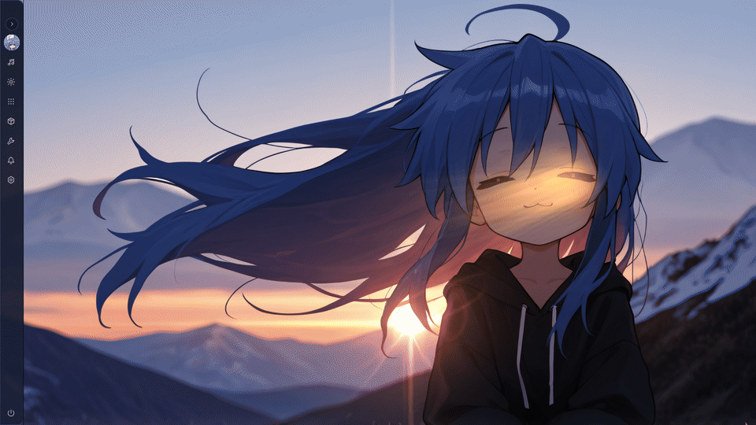
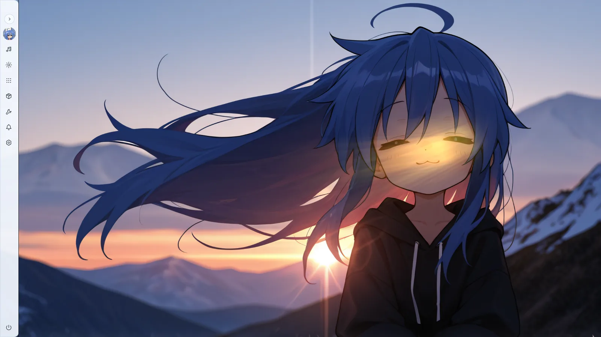
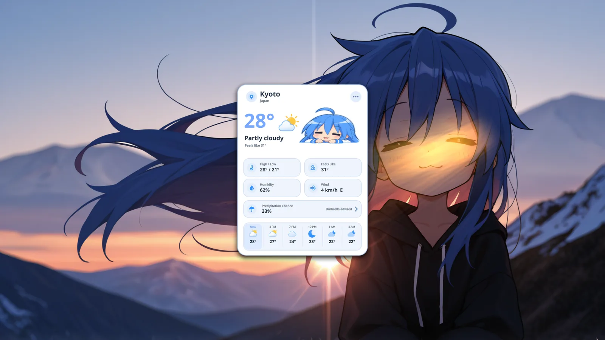
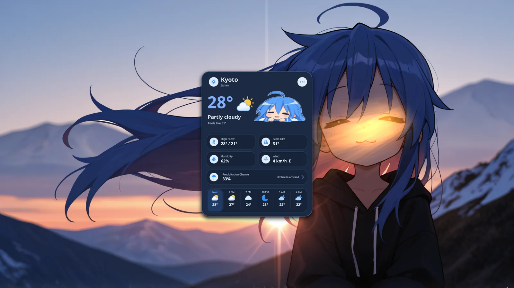
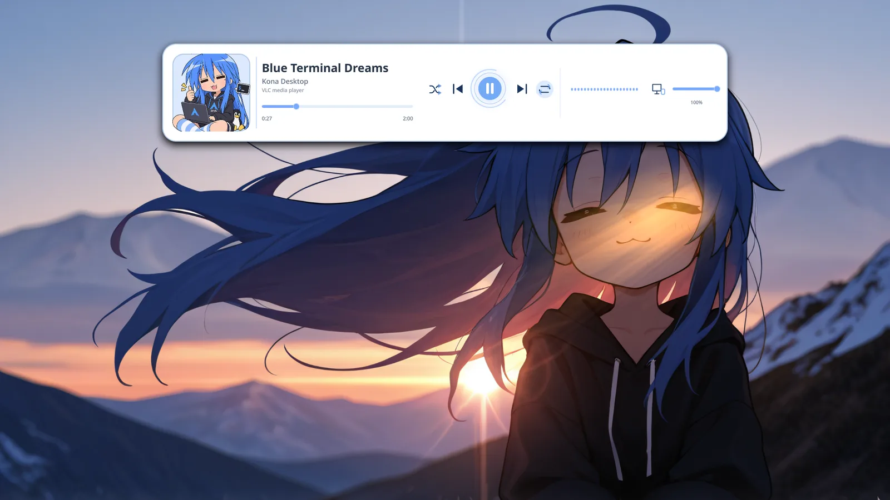
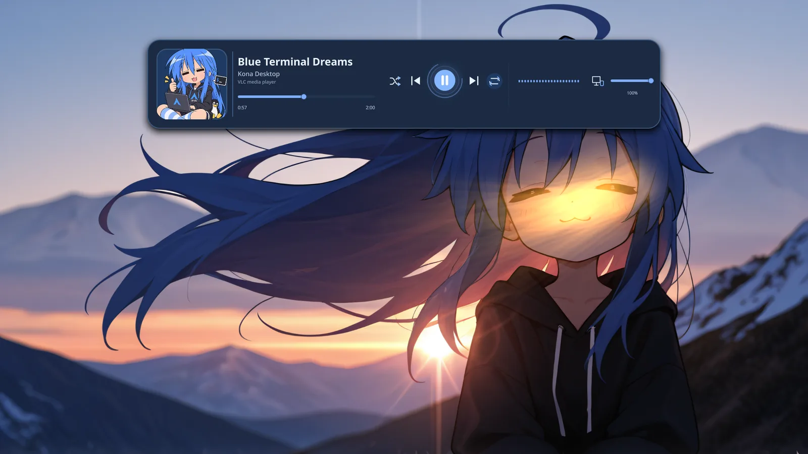
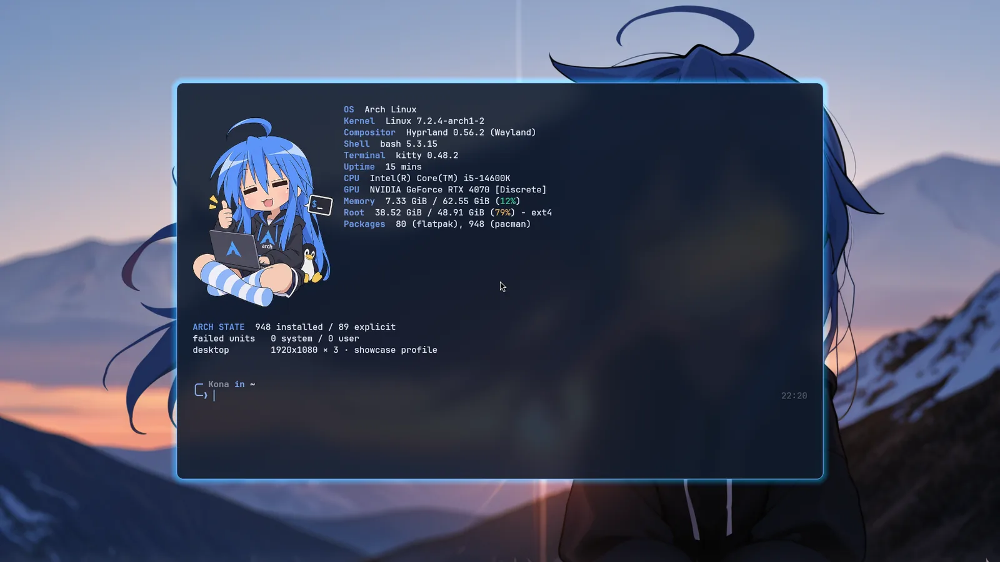
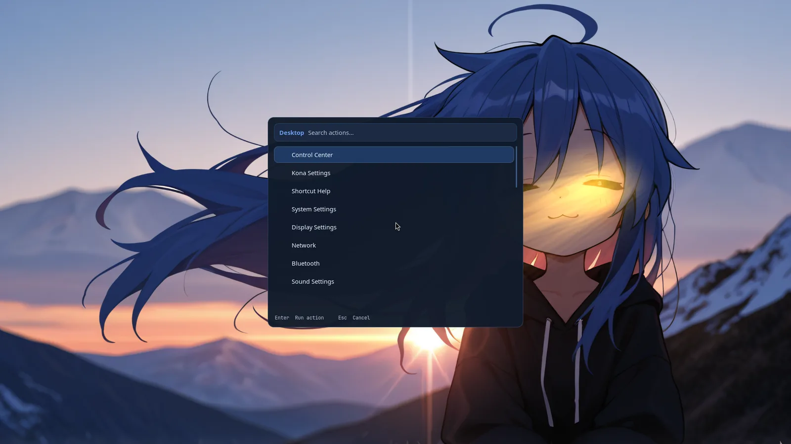

<div align="center">

# KONA DESKTOP V3

**A fast, characterful Arch Linux + Hyprland workstation.**<br>
Native Linux tools. Real system state. One coherent Konata-inspired visual language.

[](https://archlinux.org/)
[](https://hypr.land/)
[](https://wayland.freedesktop.org/)
[](https://quickshell.org/)
[](LICENSE)


*The current `main` experience: quiet when you work, expressive when you call it forward.*

</div>

> [!IMPORTANT]
> Kona is an opinionated Hyprland configuration built on a real Arch workstation. It is not an ISO or a universal installer. Review the hardware boundary and run the dry-run before installing.

## See it move



The left-edge Quickshell sidebar auto-hides, reveals from the hot edge, remembers its state, supports keyboard navigation, follows Reduced Motion, and adds no resident process while closed.

## What makes V3 different

- **Arch-first terminal workspace** — `Super + Shift + D` opens real Btop, Fastfetch and CAVA terminals on `special:arch`; closing it terminates every workspace child.
- **Quiet primary navigation** — the retired dock is replaced by one auto-hiding sidebar for profile, workspaces, apps, music, Weather and desktop actions.
- **System Light/Dark authority** — one transactional `kona-appearance` owner coordinates Kona, GTK, Qt, XDG portals and `prefers-color-scheme`.
- **Real desktop backends** — SwayNC owns notifications, PipeWire/WirePlumber own audio, NetworkManager owns networking, BlueZ owns Bluetooth, and Hyprlock/PAM own authentication.
- **Profiles and scenes** — Daily, Focus, Showcase and Gaming change policy without starting another theme daemon.
- **Wallpaper Engine integration** — downloaded Workshop Scene and Video projects can become the Daily/Showcase default while Focus and Gaming retain static policy.
- **Recovery by design** — atomic theme/profile transactions, installer backups, session snapshots, bounded helpers and explicit owner health checks.

## One desktop, two appearances

| Dark | Light |
|:---:|:---:|
|  |  |

Light and Dark share the same geometry and semantic token contract. Menus, terminals, borders, focus states, Weather, music, Waybar, SwayNC, SwayOSD, GTK, Qt and the portal preference switch together.

```bash
kona-appearance light
kona-appearance dark
kona-appearance toggle
kona-appearance status
```

## Weather without a weather daemon

| Light | Dark |
|:---:|:---:|
|  |  |

The Weather surface uses an explicit location, real Open-Meteo values, authored condition icons and a bounded local cache. It fetches on demand and leaves no poller behind.

## Music that stays native

| Light | Dark |
|:---:|:---:|
|  |  |

The Quickshell popup reads real MPRIS metadata, controls playback, follows the PipeWire output, and starts one scoped CAVA visualizer only while the surface is open.

## Arch is one shortcut away


The composition is made from real terminal windows and native Hyprland tiling. No QML terminal imitation, screenshot telemetry or background manager is involved. Repeated open/close cycles preserve one instance per component and return to zero Arch-workspace children.

| Fastfetch terminal | Desktop command center |
|:---:|:---:|
|  |  |

Kitty uses the current semantic theme; Fish provides history-based autosuggestions and completions. `Super + Grave` owns one scratch terminal, while `Alt + Return` and `Super + Return` open the normal terminal workflow.

## Lock screen continuity


Hyprlock uses the current Kona backdrop, the shared profile avatar and a deterministic falling-text layer. Password entry remains entirely inside Hyprlock/PAM with masked dots, checking/failure transitions and no custom authentication state.

## Architecture with one owner per boundary

| Boundary | Owner | Lifecycle |
| --- | --- | --- |
| Session/compositor | plain Hyprland | PlasmaLogin session |
| Primary navigation | Quickshell sidebar | on demand |
| Appearance | `kona-appearance` + `kona-theme` | transactional commands |
| Profiles/scenes | `kona-profile` | transactional commands |
| Notifications | SwayNC | one packaged user service |
| OSD | SwayOSD | one session owner |
| Audio | PipeWire + WirePlumber | upstream services |
| Music UI | Quickshell + MPRIS | transient |
| Weather | `kona-weather` + Open-Meteo | cached/on demand |
| Arch workspace | Hyprland + Kitty | zero children when closed |
| Authentication | Hyprlock + PAM | lock lifetime only |
| Wallpaper | Wallpaper Engine adapter, Awww or Hyprpaper | exactly one backend |

Read the full [architecture and ownership map](docs/ARCHITECTURE.md).

## Everyday controls

| Shortcut | Action |
| --- | --- |
| Tap `Super` / hover left edge | Pin or reveal the sidebar |
| `Super + Shift + D` | Toggle the Arch workspace |
| `Super + Return` / `Alt + Return` | Open the Kona terminal |
| `Super + Grave` | Toggle the scratch terminal |
| `Super + Space` | Applications |
| `Super + X` | Desktop command center |
| `Super + Shift + Return` | Notifications / control center |
| `Alt + Tab` | Window switcher |
| `Super + V` | Clipboard |
| `Super + W` | Workspace overview |
| `Super + Ctrl + P` | Profile picker |
| `Super + Shift + W` | Wallpaper picker |
| `Super + L` | Lock |
| `Ctrl + Alt + Delete` | Power and session |

The complete map lives in [Keybinds](docs/KEYBINDS.md).

## Install on Arch

```bash
git clone https://github.com/Denoax/konata-hyprland-dotfiles.git
cd konata-hyprland-dotfiles
./install.sh --dry-run
```

Before a real install:

1. Read [Installation](docs/INSTALL.md) and [Hardware profile](docs/HARDWARE_PROFILE.md).
2. Adapt the checked-in connector names, modes and workspace map in `.config/hypr/hyprland.lua`.
3. Review `packages/pacman.txt`; the installer deliberately does not install system packages or GPU drivers.
4. Keep a Plasma session or TTY available as a repair path.

```bash
./install.sh
```

The installer copies only Kona-owned paths and backs up every replaced target below `~/.local/state/kona/pre-restore-<timestamp>/`. Optional personal Flatpaks are excluded unless `--with-flatpaks` is passed.

## Customize it cleanly

- Semantic source colors: `.config/kona/appearance/light.json` and `dark.json`
- Monitor/input/window policy: `.config/hypr/hyprland.lua`
- Profiles and scene policy: `.config/kona/profiles.json` and `.config/kona/scene-images.json`
- Weather location: copy `.config/kona/weather.example.json` to `~/.config/kona/weather.json`
- Generated theme output: `.config/kona/theme/current/` — do not hand-edit it

See [Customization](docs/CUSTOMIZATION.md) and [Recovery](docs/RECOVERY.md).

> [!WARNING]
> Wallpaper Engine **Web** projects remain experimental on the tested Hyprland/NVIDIA stack because one validated Web project later triggered a compositor framebuffer crash. Scene and Video projects have bounded startup fallback; Web projects require explicit manual confirmation.

## Release and history

V3 is the current public `main`. The pre-V3 checkpoint is preserved at [`legacy/pre-arch-first-v3-2026.09.17`](https://github.com/Denoax/konata-hyprland-dotfiles/tree/legacy/pre-arch-first-v3-2026.09.17), and the original pre-Kona desktop remains at [`legacy/pre-kona-2026.09`](https://github.com/Denoax/konata-hyprland-dotfiles/tree/legacy/pre-kona-2026.09).

See [V3 release notes](docs/RELEASE_NOTES_V3.md) and [current validation status](docs/CURRENT_STATUS.md).

## Credits and licensing

Kona integrates independent upstream projects; each retains its own license. Original Kona code, configuration and documentation are available under the [MIT License](LICENSE).

Konata Izumi, *Lucky Star*, character artwork, Workshop content and other third-party visual/audio assets are **not** relicensed by MIT. This is an unofficial, non-commercial fan project and is not affiliated with or endorsed by the respective rights holders, Arch Linux, Hyprland or the upstream projects. Read [Third-party notices](THIRD_PARTY_NOTICES.md).
