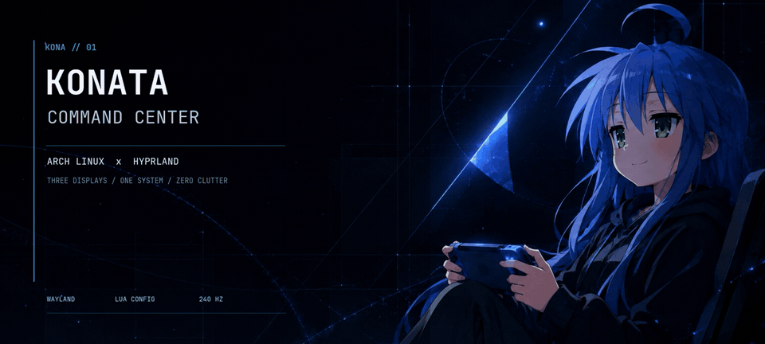
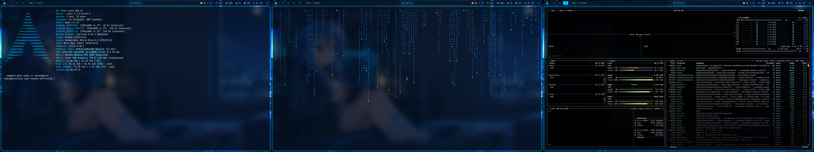
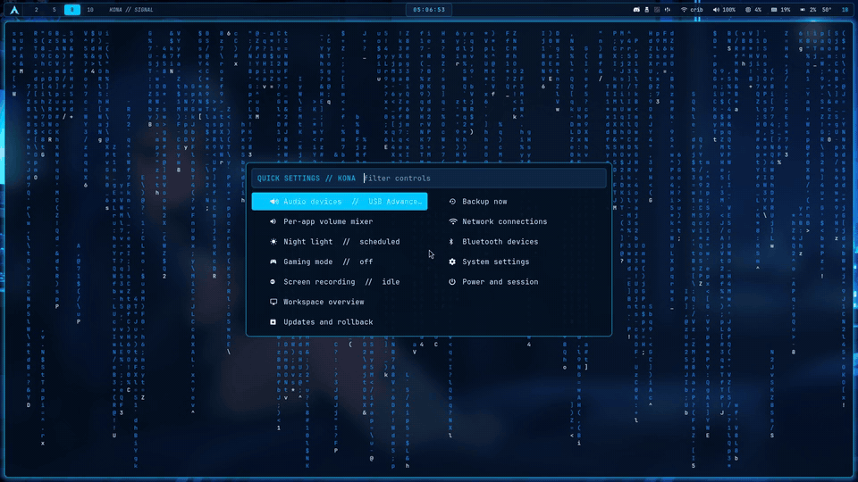
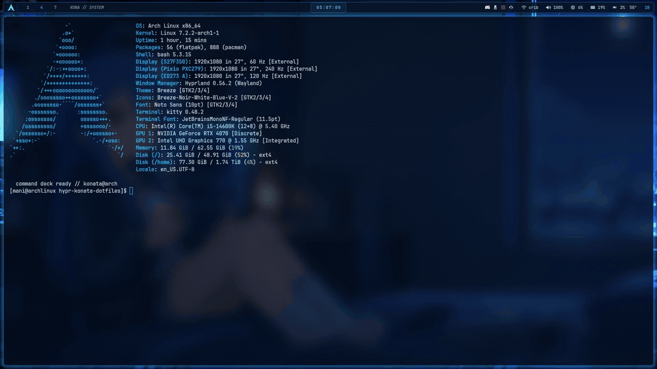
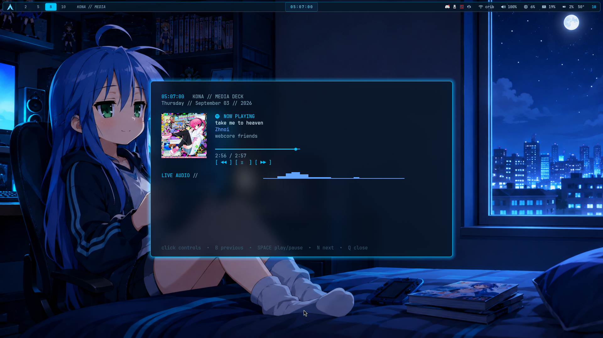
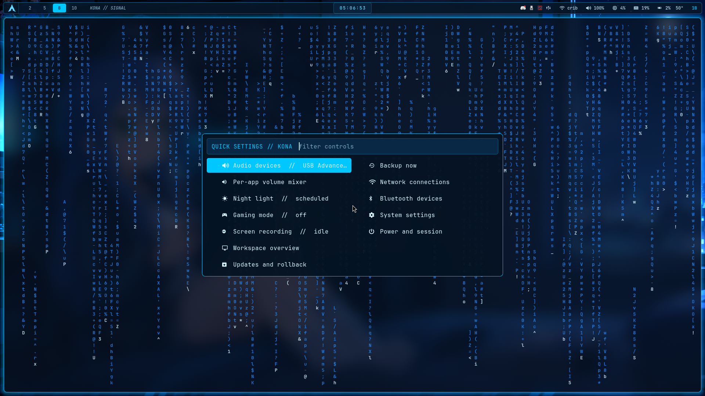
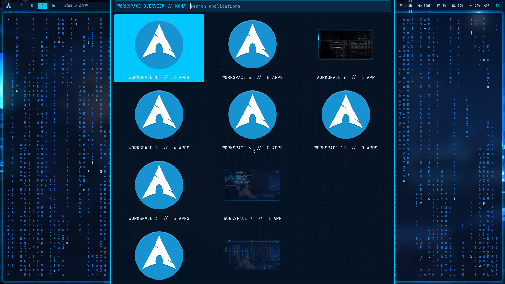
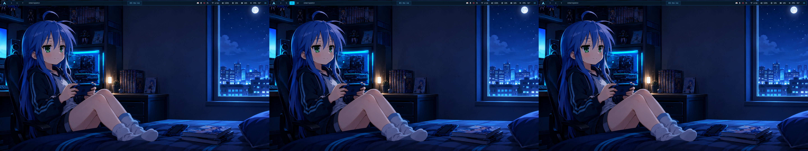

<br>

> A three-display Arch Linux environment built around midnight blue, precise
> motion, fast window control, and Konata-Chan.

Hi guys i made this complete awesome configuration for Arch-Hyprland! Hyprland is configured
in Lua and backed by a custom Waybar, auto-hiding dock, application launcher,
media deck, audio controls, session restoration, workspace memory, capture
tools, night light, gaming mode, and recovery workflow.

## The desktop



| Interface layer | Terminal layer |
| --- | --- |
|  |  |

### Media deck



The media view is a real interactive terminal application. It reads MPRIS
metadata, downloads the current cover, tracks progress, drives playback, and
renders live PipeWire audio through CAVA.

<details>
<summary><strong>More real screenshots</strong></summary>

#### Quick settings



#### Workspace overview



#### Clean three-monitor wallpaper



</details>

## System map (My Monitor Configuration)

```text
SAMSUNG / HDMI-A-1        PIXIO / DP-4                    ACER / HDMI-A-5
1920×1080 @ 60 Hz         1920×1080 @ 240 Hz              1920×1080 @ 120 Hz
workspaces 1 / 4 / 7      workspaces 2 / 5 / 8 / 10       workspaces 3 / 6 / 9
```

| Layer | Implementation |
| --- | --- |
| Compositor | Hyprland 0.56+ using native Lua configuration |
| Session | UWSM-managed Wayland session with KDE Plasma kept as fallback |
| Shell | Waybar, Rofi, SwayNC, nwg-drawer, and a customized nwg-dock-hyprland |
| Terminal | Kitty + JetBrainsMono Nerd Font |
| Audio | PipeWire, WirePlumber, MPRIS, Playerctl, and CAVA |
| Capture | Grim, Slurp, Satty, wf-recorder, and the Hyprland desktop portal |
| Wallpaper | Awww with static and animated three-monitor sets |

## What is built in

- **Windows-like muscle memory.** `Alt + Tab`, `Alt + F4`, maximize, minimize,
  show desktop, snapping, edge resizing, and monitor-aware movement.
- **Independent drag and tab groups.** Drag windows freely or drop one directly
  over another to create a compact tabbed group.
- **Smart bottom dock.** It appears at the screen edge or with a tap of Super,
  follows the active monitor, searches apps, closes apps directly, and restores
  minimized windows.
- **Quick control layer.** Audio devices, per-app volume, night light, gaming
  mode, screen recording, workspace overview, updates, backup, Wi-Fi,
  Bluetooth, settings, and power live in one panel.
- **Remembered state.** Supported apps return to their workspace at login;
  floating windows also retain exact size, position, and fullscreen state.
- **Visible system state.** Recording and gaming modes get persistent Waybar
  indicators. Volume, brightness, media, Caps Lock, and Num Lock use a themed
  on-screen display.
- **Safe maintenance.** Updates require confirmation, use a full `pacman -Syu`,
  and expose package history and cached versions for rollback investigation.
- **Reproducible recovery.** Configuration, custom binaries, wallpapers,
  dependency manifests, capture scripts, and a tested restore path live here.

## Install

This repository currently targets Arch Linux and Hyprland's Lua configuration
introduced in Hyprland 0.55. It is a personal hardware profile made public for
people to use, study, and adapt.

```bash
git clone https://github.com/Denoax/konata-hyprland-dotfiles.git
cd konata-hyprland-dotfiles
./install.sh
```

The installer:

1. backs up replaced configuration under `~/.local/state/kona/`;
2. restores the shell, scripts, wallpapers, and custom dock;
3. downloads Satty, SwayOSD, wf-recorder, and Hyprsunset into a user-local
   directory without requiring sudo;
4. restores missing Flatpak applications;
5. records the clone location so `kona-backup` can update the same repository.

System packages are intentionally **not** installed automatically. Review
[`packages/pacman.txt`](./packages/pacman.txt), then install the pieces suitable
for your machine. NVIDIA and Intel packages in that list describe the original
computer; they are not universal recommendations.

### Change the monitor map first

The checked-in profile uses `HDMI-A-1`, `DP-4`, and `HDMI-A-5`. Run
`hyprctl monitors`, then edit the monitor and workspace rules near the top of
[`hyprland.lua`](./.config/hypr/hyprland.lua) if your connector names,
resolutions, positions, or refresh rates differ.

For a configuration-only recovery or test:

```bash
./install.sh --config-only
./tests/recovery-smoke.sh
```

## Controls

| Shortcut | Action |
| --- | --- |
| Tap `Super` | Show or hide the dock |
| `Super + Space` | Application launcher |
| `Super + C` | Unified quick settings |
| `Super + W` | Thumbnail workspace overview |
| `Super + Return` | Terminal |
| `Super + Shift + Return` | Three-screen command center |
| `Alt + Tab` | Window switcher |
| `Alt + F4` | Close window |
| `Ctrl + H` / `Super + H` | Minimize active app |
| `Alt + left drag` | Move a window independently |
| `Alt + right drag` | Resize a window |
| `Super + G` | Gaming mode |
| `Super + U` | Updates and rollback |
| `Super + Shift + A` | Audio-device picker |
| `Super + Ctrl + A` | Per-app audio mixer |
| `Super + Shift + S` | Region capture + annotation |
| `Super + Shift + R` | Start or stop region recording |
| `Super + Ctrl + Shift + R` | Record the active monitor |
| `Ctrl + right-click` on desktop | Desktop/system menu |

The full binding map lives in [`hyprland.lua`](./.config/hypr/hyprland.lua).

## Repository anatomy

```text
.config/                 compositor and desktop configuration
.local/bin/              Kona control scripts and custom dock
.local/share/            desktop entry and wallpaper collection
packages/                Arch, Flatpak, and user-service manifests
patches/                 exact custom-dock source changes
showcase/                real capture and deterministic media render tools
tests/                   isolated recovery smoke test
install.sh               backup-aware restore entry point
```

`showcase/capture-showcase.sh` stages clean workspaces 7–9, captures the real
desktop, and restores the previous workspace state. `showcase/render-media.sh`
rebuilds the sharp title treatment, MP4 clips, and optimized GIFs.

## Recovery

KDE Plasma remains installed and unmodified. If the Hyprland profile ever
needs repair, log out, select Plasma at the login screen, and run:

```bash
kona-backup
# or, from a clean clone
./install.sh
```

## Credits and status

The custom dock is based on
[`nwg-piotr/nwg-dock-hyprland`](https://github.com/nwg-piotr/nwg-dock-hyprland)
v0.4.11 under the MIT License. See
[`THIRD_PARTY_NOTICES.md`](./THIRD_PARTY_NOTICES.md) for its exact patch and the
fan-project disclaimer.

Konata Izumi and Lucky Star belong to their respective creators and rights
holders. This repository is an unofficial, non-commercial fan project and is
not endorsed by the rights holders, Arch Linux, or Hyprland.
